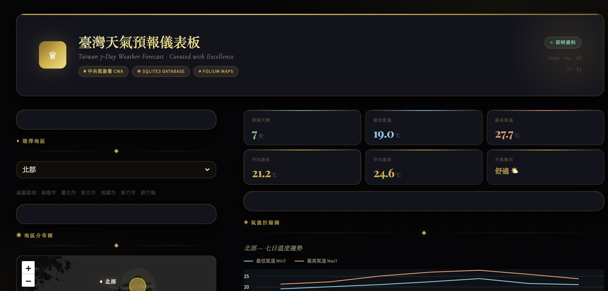

# HW2 開發對話記錄 / Conversation Log

> 專案：臺灣天氣預報系統（CWA API + SQLite3 + Streamlit）  
> 日期：2026-04-24  
> 工作目錄：`/Users/wangdacheng/大學/大三/AIOT/hw2`

---

## 對話 1 — 建立完整 HW2 專案

### USER 需求

建立一個完整的 Python 專案，包含以下四個子任務：

1. **HW2-1 & 2**：使用 `requests` 從 CWA API（F-D0047-091）抓取臺灣各地區 7 天天氣預報 JSON，解析出 `regionName`、`dataDate`、`mint`（最低溫）、`maxt`（最高溫）。
2. **HW2-3**：將資料存入 SQLite3 資料庫 `data.db`，資料表名稱為 `TemperatureForecasts`，欄位包含 `id`（PK）、`regionName`、`dataDate`、`mint`、`maxt`。
3. **HW2-4**：建立 Streamlit 應用程式，左右版面配置：
   - 左側：下拉選單選擇地區 + Folium 互動式地圖。
   - 右側：折線圖（氣溫）+ 資料表格。
   - **資料必須從 `data.db` 讀取，不能用 CSV。**
4. 程式頂部留有 CWA API 授權金鑰的設定區。

### AI 執行動作

建立以下四個檔案：

| 檔案 | 說明 |
|------|------|
| `config.py` | API 金鑰、資料庫路徑、區域對應表、座標常數 |
| `hw2_fetch.py` | HW2-1~3：抓取 → 解析 → UPSERT 存入 DB |
| `hw2_app.py` | HW2-4：Streamlit 左右版面（Folium 地圖 + 折線圖 + 資料表） |
| `requirements.txt` | `requests`, `urllib3`, `streamlit`, `folium`, `streamlit-folium`, `pandas` |
| `README.md` | 完整執行說明文件 |

安裝依賴套件：

```bash
pip3 install -r requirements.txt
# → 成功安裝至 Python 3.9
```

語法檢查通過：

```bash
python3 -m py_compile config.py hw2_fetch.py hw2_app.py
# → Syntax OK
```

---

## 對話 2 — 修正 `parse_forecast` 函式（JSON Key 錯誤）

### USER 需求

程式已可成功連線 CWA API（HTTP 200），但解析後回傳 **0 筆資料**。原因是 JSON key 大小寫錯誤、取值路徑有偏差，請依照以下正確結構修正：

- `LocationName` → `locationName`
- `ElementName` → `elementName`
- `Time` → `time`
- `StartTime` → `startTime`
- `ElementValue` → `elementValue`
- 氣溫數值存放在 `elementValue[0].get("value")`，不是 `.get("MinT")` / `.get("MaxT")`

### AI 執行動作

**第一次修正**（依 USER 描述）：

將 `parse_forecast` 中所有 key 改為小寫版本，氣溫改由 `elementValue[0]["value"]` 取得。

**發現仍然 0 筆** → 直接打 API 探查實際 JSON 結構：

```python
# 探查腳本輸出
records keys: ['Locations']
records['Locations'] is a list of 1, first item keys: ['DatasetDescription', 'LocationsName', 'Dataid', 'Location']
Location keys: ['LocationName', 'Geocode', 'Latitude', 'Longitude', 'WeatherElement']
WeatherElement[0] keys: ['ElementName', 'Time']
Time[0] keys: ['StartTime', 'EndTime', 'ElementValue']
ElementValue[0] keys: ['Temperature']
```

進一步確認所有 ElementName：

```
ElementName='平均溫度'   → ElementValue[0] = {'Temperature': '19'}
ElementName='最高溫度'   → ElementValue[0] = {'MaxTemperature': '20'}
ElementName='最低溫度'   → ElementValue[0] = {'MinTemperature': '18'}
...（共 15 種要素）
```

**第二次（正確）修正**：

| 原本程式 | ✅ API 實際正確 |
|---|---|
| `records["locations"]` | `records["Locations"]` |
| `["location"]` | `["Location"]` |
| `["locationName"]` | `["LocationName"]` |
| `["weatherElement"]` | `["WeatherElement"]` |
| `elem["elementName"]` | `elem["ElementName"]` |
| `elem["time"]` | `elem["Time"]` |
| ElementName `"MinT"` | `"最低溫度"` |
| ElementName `"MaxT"` | `"最高溫度"` |
| `ElementValue[0]["MinT"]` | `ElementValue[0]["MinTemperature"]` |
| `ElementValue[0]["MaxT"]` | `ElementValue[0]["MaxTemperature"]` |

### 驗證結果

```bash
python3 hw2_fetch.py
# [INFO] API 請求成功，HTTP 狀態碼：200
# [INFO] 共解析 308 筆預報記錄。
# [INFO] 成功儲存 308 筆資料至 data.db
# [DONE] 資料已成功儲存至 data.db
```

✅ **308 筆資料成功解析並存入資料庫。**

---

## 對話 3 — 修復 Streamlit 啟動錯誤（模組找不到）

### USER 錯誤訊息

```
python3 -m streamlit run hw2_app.py
...
ModuleNotFoundError: No module named 'folium'
```

### 根本原因

電腦上存在兩個 Python 環境：

| Python 版本 | 路徑 | 說明 |
|---|---|---|
| Python 3.9 | `/usr/bin/python3` | 套件裝在這裡（pip3 預設） |
| Python 3.14 | `/Library/Frameworks/Python.framework/Versions/3.14/...` | Streamlit 指令實際使用的版本 |

`pip3 install` 把套件裝到 3.9，但 `python3 -m streamlit` 執行的是 3.14，因此 3.14 環境找不到 `folium`。

### AI 執行動作

用 Python 3.14 的 pip 明確安裝：

```bash
/Library/Frameworks/Python.framework/Versions/3.14/bin/python3 -m pip install \
    folium streamlit-folium streamlit pandas urllib3
# → Successfully installed branca-0.8.2 folium-0.20.0 streamlit-folium-0.27.1 xyzservices-2026.3.0
```

同時修正 `hw2_app.py` 中三處 Streamlit 1.55 棄用警告：

```python
# 舊版（已棄用）
use_container_width=True

# 新版
width="stretch"
```

### 驗證結果

```bash
python3 -m streamlit run hw2_app.py
# You can now view your Streamlit app in your browser.
# Local URL: http://localhost:8502
```

✅ **App 成功啟動，無錯誤、無警告。**

---

## 最終專案結構

```
hw2/
├── config.py        ⭐ API 金鑰（CWA_API_KEY）& 常數
├── hw2_fetch.py     HW2-1~3：抓取、解析、存入 SQLite3
├── hw2_app.py       HW2-4：Streamlit 視覺化儀表板
├── data.db          SQLite3 資料庫（自動產生）
├── requirements.txt 相依套件列表
├── README.md        執行說明
└── log.md           本對話記錄
```

## 執行指令速查

```bash
# 1. 設定 API 金鑰（編輯 config.py）
# CWA_API_KEY = "CWA-XXXXXXXX-XXXX-XXXX-XXXX-XXXXXXXXXXXX"

# 2. 抓取資料並存入資料庫
python3 hw2_fetch.py

# 3. 啟動視覺化 App
python3 -m streamlit run hw2_app.py
# → 開啟瀏覽器 http://localhost:8501
```

## 重要技術筆記

### CWA API F-D0047-091 JSON 結構（已驗證）

```
records
  └─ Locations  [PascalCase, list, 取 [0]]
       └─ Location  [list, 逐筆走訪]
            ├─ LocationName          → regionName
            └─ WeatherElement  [list]
                 ├─ ElementName = "最高溫度"
                 │    └─ Time[i]
                 │         ├─ StartTime  → dataDate（取前 10 字元）
                 │         └─ ElementValue[0]["MaxTemperature"] → maxt
                 └─ ElementName = "最低溫度"
                      └─ Time[i]
                           └─ ElementValue[0]["MinTemperature"] → mint
```

### Python 多版本環境注意事項

在 macOS 上若有多個 Python 版本，套件安裝必須對應執行環境：

```bash
# 確認 streamlit 使用的 Python
python3 -m streamlit --version    # 查看版本
which python3                     # 查看路徑

# 安裝套件至指定 Python
/path/to/target/python3 -m pip install <package>
```

---

## 對話 4 — 美化 Streamlit 網站（Premium Dark Edition）

### USER 需求

大幅美化 `hw2_app.py`，提升視覺質感。

### AI 執行動作

全面重寫 CSS 設計層，升級項目：

| 項目 | 升級內容 |
|------|---------|
| 背景 | 動態深藍漸層 + 固定附著背景 |
| Header | 浮動天氣圖示動畫 + 漸層標題文字 + 即時時鐘 + Live 綠點 |
| 卡片 | Glassmorphism 玻璃磨砂效果（`backdrop-filter: blur`） |
| 指標 | 6 張指標卡，頂部彩色漸層線條（冷=藍、熱=橘、天數=綠） |
| 折線圖 | 新增圖例列 |
| 資料表 | 新增「溫差」欄位，以 `ProgressColumn` 進度條顯示 |
| 地圖 | 選中區域加外圈發光暈環，文字加 CSS glow 效果 |

---

## 對話 5 — 推送專案至 GitHub

### USER 需求

將整個專案推送至 `git@github.com:dachengwang-0218/aiot_hw2.git`

### AI 執行動作

1. 建立 `.gitignore`（排除 `data.db`、`__pycache__`、`.DS_Store` 等）
2. 將 `config.py` 中的真實 API 金鑰替換為 `"YOUR_CWA_API_KEY_HERE"`（防止金鑰外洩）
3. `git init` → `git add .` → `git commit` → `git remote add origin` → `git push`

### 結果

```
[main 3419c22] feat: HW2 complete — CWA API fetch, SQLite3 DB, Streamlit dashboard with Folium map
20 files changed, 1409 insertions(+)
→ 推送至 https://github.com/dachengwang-0218/aiot_hw2
```

---

## 對話 6 — 推送新截圖

### USER 需求

新增一張「網站展示.png」截圖，推上 GitHub。

### AI 執行動作

```bash
git add . && git commit -m "docs: 新增網站展示截圖" && git push
# → [main 3757260] docs: 新增網站展示截圖
```

---

## 對話 7 — 極簡幾何 UI 大改版（Refined Geometric Minimalism）

### USER 需求

導入「現代極簡且具備幾何一致性」設計準則：
- CSS 變數統一設計 Token
- Space Grotesk + Inter 字體組合
- 背景網格紋理 + 徑向光暈
- Glassmorphism 卡片 + 深層陰影
- 純 CSS hover 微動畫
- 高對比深色主題

### AI 執行動作

完整重寫 CSS 設計系統：

- `:root {}` 統一管理所有色彩、圓角、陰影 Token
- `background-image` 疊加 40px 網格線 + 兩個徑向漸層光暈（固定附著）
- `.card` 統一卡片系統：1px 邊框 + `box-shadow` + hover lift 效果
- `.mc` 指標卡：頂部 2px 彩色漸層線條
- `@keyframes fadeUp` 載入動畫 + hover `translateY(-3px)`
- LIVE badge：綠點閃爍
- Folium 地圖標記：glow text-shadow

---

## 對話 8 — 尊爵奢華黑金版（Luxury Gold Edition）

### USER 需求

「給我尊爵奢華的版面」

### AI 設計決策

| 維度 | 設計選擇 |
|------|---------|
| 主色 | `#050507` 深宇宙黑 + `#D4AF37` 香檳金 |
| 字體 | `Playfair Display`（歐洲奢侈品牌御用襯線體）+ `Cormorant Garamond` 斜體副標 |
| 背景 | 48px 金色格線 + 兩個暗金徑向光暈，`background-attachment: fixed` |
| Hero 頂條 | 金箔漸層光帶 `shimmer` 無限流動動畫 |
| 分隔線 | 菱形寶石 `◆` + 兩側漸層消散線條（裝飾性分隔） |
| 指標卡 | 頂部 1.5px 亮金漸層 |
| 地圖 | 全系列金色調，選中區域 `♦` 圖標 + glow 光暈 |
| Hover | 卡片上浮 3px + 金色邊框加亮 |

```bash
git commit -m "style: 尊爵奢華黑金版 UI — Luxury Gold Edition"
→ 推送至 GitHub
```

---

## 對話 9 — README 加入網站展示截圖

### USER 需求

將網站展示截圖放入 `README.md`。

### AI 執行動作

在 README 標題下方新增：

```markdown
## 網站展示 / Preview


```

後續因 GitHub CDN 快取未更新，加入版本參數強制刷新：

```markdown

```

---

## 對話 10 — 推送 data.db 至 GitHub

### USER 需求

將 `data.db` 也推上 GitHub。

### AI 執行動作

1. 修改 `.gitignore`，將 `data.db` 的排除規則註解掉
2. `git add .gitignore data.db`
3. `git commit -m "feat: 加入 data.db 天氣預報資料庫" && git push`

### 結果

```
[main 318c3a3] feat: 加入 data.db 天氣預報資料庫
2 files changed, 2 insertions(+), 2 deletions(-)
create mode 100644 data.db
```

---

## Git Commit 歷史摘要

| Commit | 說明 |
|--------|------|
| `3419c22` | feat: HW2 complete — 初始專案建立 |
| `3757260` | docs: 新增網站展示截圖 |
| `2e9cff0` | style: 尊爵奢華黑金版 UI |
| `3f854ad` | docs: 在 README 加入網站展示截圖 |
| `46d5faa` | docs: 更新網站展示截圖 |
| `870d568` | docs: 強制刷新 README 圖片快取 (v=2) |
| `318c3a3` | feat: 加入 data.db 天氣預報資料庫 |

---

*最後更新：2026-04-28*
